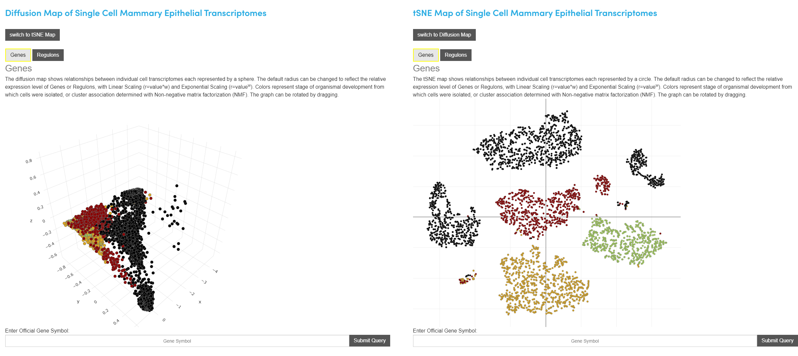
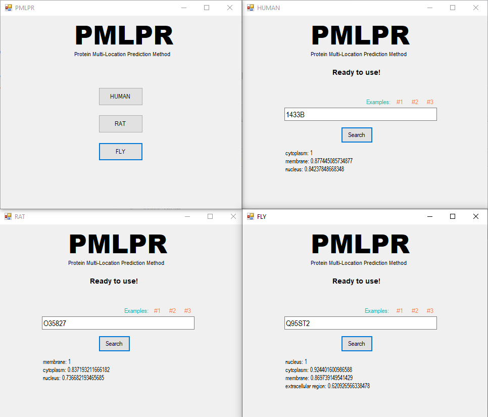

##### Interactive Visualization web tool for Single Cell Mammary Epithelial Transcriptomes

This project provide an interactive webtool to visualize genes and regulon expressions across Single Cell Mammary Epithelial Transcriptomes. This tool provide tSNE and diffusion map representation of the cell, and the expression of the genes can be scaled for better understanding of the data.

You can check out the webtool [here](http://uofuhealth.utah.edu/huntsman/labs/spike/d3.php)

##### Subcellular Protein Localization

PMLPR (Protein Multi-Location Prediction based on Recommendation system) is a method to predict multiple locations for proteins. PMLPR predicts locations for each protein based on a well-known recommendation method called NBI, and the STRING protein-protein interaction database. For each protein, PMLPR propose a reliability score (the best score is equal to 1).  

You can download [here](http://facultymembers.sbu.ac.ir/eslahchi/en/portfolio-items/subcellular-protein-localization/)

